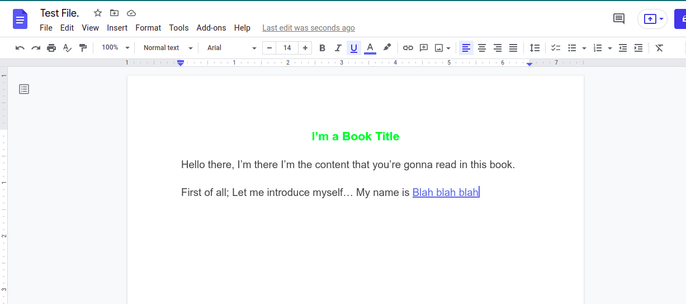
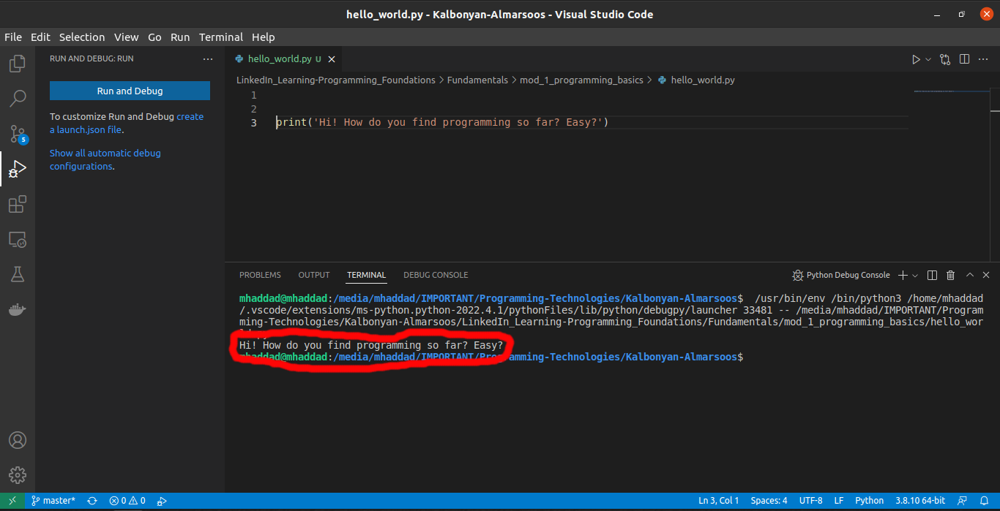

# [Programming Foundations: Fundamentals (LinkedIn Learning)](https://www.linkedin.com/learning/programming-foundations-fundamentals-3?contextUrn=urn%3Ali%3AlyndaLearningPath%3A56db2b643dd5596be4e4989b)


I've already watched this course, took notes in my *notebook*, practiced, and solved all of the challenges.

But that was before the due date of the training so for the sake of honesty, I'm gonna have to re-watch the course again, solve the challenges, and upload them to Github.

## What's the reason for this README?

In this **README**, and all the READMEs that are coming in the future I'll be documenting my journey, my notes on the course, my questions, my struggles and so on but because I've already studied this course and took notes, for the sake of saving time I won't be taking notes here in details, instead; I'm just gonna take quick notes on the concepts explained in the course, solve the challenges and upload them and that's it.

In later courses; courses that I haven't studied yet, I'm gonna take detailed notes -insha'Allah-.

Without any further ado, let's get into the course.
---
<br>

## Module 1: Programming Basics.

### What is programming?

> Programming is a set of instructions given to the computer to perform a specific task.

Okay that's too nerdy, well simply put;

>Porgramming is a way for us -humans- to communicate with computers.

#### Example:
Let's say that your dad wants you to do a task for him, umm "fix the sink", He's going to work and you're asleep what he can do is:

Write the instructions that you're gonna follow on a piece of paper and stick it on your bulletin board


1. Go to the garage.
2. Grab the toolbox.
3. Use the wrench to loosen the sink

And so on, you get the idea.

That's a set of instruchtions that you can follow exactly to perform a task which is "Fixing the sink".

The same thing with programming, if you want your computer to perform a task, you're gonna have to write some instructins to the computer to do that task.

**Those instructions** have to follow some rules:

1. Written in a way that a computer can understand.
2. Written in the correct order.
3. clear of ```bugs``` otherwise your program will ```crash```, or won't work.

**Bug** refers to a mistake in your instructions that caused the computer not to perform your task because it didn't understand it.

**Crash** is when your computer suddenly stops performing your task and that's because there's a bug in your instructions.


### What is programming language?

Simply put, it's the tool or way you use to tell a computer your instructions, just like us -humans- need a language to communicate with one another, we also need a language to communicate with computers.

*There are many programming languages* each is used to perform a specific kind of task, some  are used to build websites, some are used to build applications that would run on your mobile phone, some are used to program robots.

#### Examples.

```C++```, ```C```, ```Python```, ```Java```, ```JavaScript```, ```Swift```.

Let's write a tiny program that would print this line of text on the screen of your computer: ```"Hi! How do you find programming so far? Easy?"```

``` python
print('Hi! How do you find programming so far? Easy?')
```

That's written in the ```Python``` language.


```java
System.out.println("Hi! How do you find programming so far? Easy?");
```

And that's how you print the same line in the ```Java``` language.

You can see some other texts and symblos besides the line we wanna display, right?

And that's the ```Sytanx``` used to display a text on the screen in ```python``` and ```java```.

**Syntax** are the rules that we have to follow when writing instructions to the computer so that it would understand our instructions.

Just like writing question mark at the end of a questin '?' so that the reader understand that it's a question or a dot '.' so that it would know that the paragraph is finished here, we also use specific rules or ```syntax``` to make computers understand our instructions.

**But** computers only understand one langauge and it's called ```Machine Language``` but that language is very hard for us humans to write code in, so we use an easier kinda of programming languages; languages that are close to our "human" spoken langauges then those languages are translated into that ```machine language``` so that the computer would understand.

### Source Code...?

Source code is the file containing your ```Syntax``` 📄.

The ```Python``` example that we've written up there, would be saved like this ```pythong_sourse_code.py```

the ```.py``` is the file's extension, or type a way to tell what kind file is that, like ```.pdf``` to tell that this file is a book file, ```.docx``` to tell taht it's a word file. And you can name your file whatever name you want but it's a good practice to use a representing name that would give us a hint of what the code inside this file does.

### Running those instuctions/code/source files.

Now, to make a computer perform your instructions you have to translate your instructions from that ```high level``` programming language to the ```machine code``` language that computers understand.

And to do so we have 2 different ways:

1. **Compiling**

    And that means translating the entire code/instructions into ```machine code``` then run it.

2. **Interpreting**

    And that's translating your code one line by one line.

    - Trnalste 1 line, run it.
    - Translate another, run it, And so on.
  
  #### Programming langauges that use Compiling:

  - C++
  - C
  
  #### Programming langauges that use Interpreting:

  - PHP

#### Programming langauges that uses a combination of both:

- Pythong
- Java

### What's an IDE?

In order to write a word file, you're gonna need an editor or a program to write and style your text like ```Microsfot Word``` or ```Google Docs```



The reason behind using this editor is to make it easy for you to write your text, style it or format it, like changing the color of a words or its style.

**When writing code** We need some kinda tool to achieve the same goal, make it easy to write our code/instructions and make it more readable.

```IDE``` stands for **Integration Development Environment**.

Which is a program used to write, and run our code.

#### Examples:

- VS Code.
- Visual Studio.
- Android Studio.



That's our python example that displays a line of text on the screen, and you can see the text there inside the red semi-box 😂.

---
<br>

Well, ended taking detailed notes after all, and that's taking me sooo long so.. 
here's what I'm gonna do from here on out:

> I'm gonna watch the courses, takes notes in my notebook, solve the challenges and upload them. Then I'll specific one day in the week where I would just write this kind of explanatory articles to demonstrate what I learned and that's for a couple of reasons, > 
> 1.  Acting based on the quote "The best way to learn something is by teaching it"
> 2. For the sake of helping anyone out there understand somethign.
> 3. Just for the sake of documenting my journey

And that's about it for this module.

---
---
<br>

## Module 1: Programming Syntax.